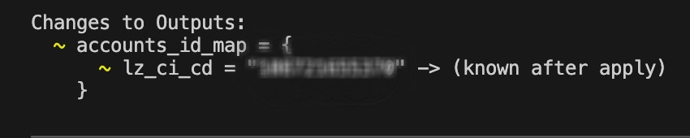
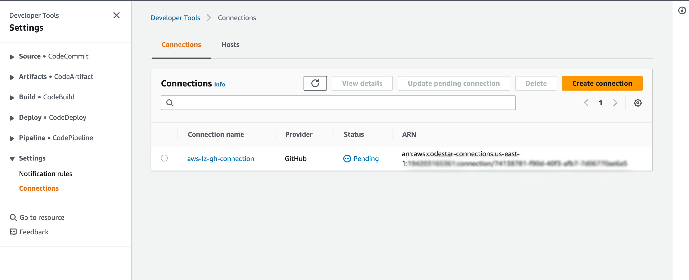
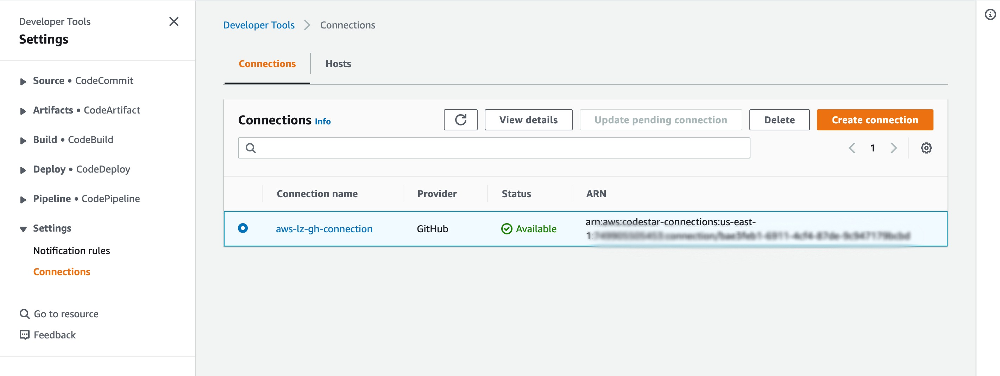

# AWS Landing Zone
[](https://github.com/ollionorg/aws-landing-zone/wiki/User-Guide)
[](https://opensource.org/licenses/Apache-2.0)
[](https://discord.gg/aY8EBx4t)
[](https://github.com/ollionorg/aws-landing-zone/wiki/User-Guide#how-compliant-your-landing-zone-to-well-known-best-practices)


## Repo directory structure
Follow the below directory structure:

```
repo:
├── 0-bootstrap
│   ├── bootstrap.sh
│   ├── bootstrap
│   ├── cicd
│   │   ├── inventories
│   │   └── modules
│   │       └── cicd
│   │           └── templates
│   └── tf-prerequisites
├── 1-org
|   ├── aws-secure-baseline
│   │   ├── alarm-baseline
│   │   ├── iam-ebs-secure-baselines
│   │   └── s3-baseline
│   ├── billing
│   ├── cloudtrail
│   ├── cloudwatch-s3-exporters
│   │   ├── Dev
│   │   ├── Prod
│   │   └── Staging
│   ├── config
│   ├── detective
│   ├── guardduty
│   ├── infra-cicd
│   ├── kms
│   ├── macie
│   ├── logging-buckets
│   ├── permission-sets
│   ├── rego-s3-sync
│   ├── securityhub
│   ├── shared-service
├── 2-network
│   ├── dns-hub
│   │   ├── dns-securtiylogging
│   │   ├── firewall
│   │   ├── route53resolver
│   │   ├── transit-gateway
│   │   └── vpc
│   └── network-hub
│       ├── firewall
│       ├── high-trust
│       ├── transit-gateway
│       └── vpc
├── 3-env
│   ├── dev
│   │   ├── transit-gateway
│   │   └── vpc
│   ├── prod
│   │   ├── transit-gateway
│   │   └── vpc
│   └── staging
│       ├── transit-gateway
│       └── vpc
├── img
├── permissionset-compliance
│   ├── report
│   └── validation
├── rego
│   └── rules
├── terraform
│    ├── modules
│    └── scp-stored    
├── Dockerfile
├── apply.sh
├── destroy.sh
├── destroy-all.sh
├── global-lz-state-backend.conf
├── lzconfig.yaml
├── nuke.sh
├── plan.sh
├── prebuild.sh
├── regula-prebuild.sh
├── regula-spec.yaml
├── regula.sh
├── terraform-exec.sh
└── terraform-spec.yaml
```
---

## Software Prerequisites
To run the commands described in this document, you need to have the following installed:
- AWS CLI v2.8.2
- Terraform v1.4.5
- git v2.38.1

## Prerequisites:
1. AWS Account that will be used as a Management Account
2. Setup of AWS SSO by any supported Identity Provider
3. Setup of AWS Organization (this will be done automatically while setting up SSO)
4. Deployer should be a part of the admin permission set for the Management account.
5. Complete authentication with aws credentials i.e. AWS_ACCESS_KEY_ID, AWS_SECRET_ACCESS_KEY, AWS_SESSION_TOKEN
	- Go to the AWS access portal URL
	- Select Management account
	- Click on the Command line or programmatic access.
	- Copy the environment variable and paste it on AWS CLI to get authenticated.
6. Increase the limit to create AWS account API calls. This landing zone deployment requires at least 18 accounts including the management account.
7. There are a few steps that require manual approval and the deployer should be approving them appropriately.

> For more information about the permissions that are required, and the resources that are created, see the organization bootstrap module documentation.


## Deployment Process

### Step 0 - Forking Github repo

Follow the steps to fork or clone the landing zone GITHUB repo on your local machine:
1. Create a personal access token (PAT) on GitHub. Goto GitHub profile > Settings > Developer Settings > Personal Access Tokens > Generate New Token.
2. Set username and generated PAT in your machine.
3. Clone the repo:
```
git clone https://github.com/ollionorg/aws-landing-zone.git
```

### Step 1 - Collect configuration information
- Ensure the configuration parameters inside the file [lzconfig.yaml](https://github.com/ollionorg/aws-landing-zone/blob/main/lzconfig.yaml) are properly set and commit the changes to the repository.
- Update the [global-lz-state-backend.conf](https://github.com/ollionorg/aws-landing-zone/blob/main/global-lz-state-backend.conf) with the backend s3 bucket, Region, and DynamoDB Table.


### Step 2 - Invoke the bootstrap script
Authenticate the shell with AWS IAM credentials belonging to the administrator user of the management account and trigger the script [0-bootstrap/bootstrap.sh](https://github.com/ollionorg/aws-landing-zone/blob/main/0-bootstrap/bootstrap.sh)

The script will do Terraform apply in [0-bootstrap/tf-prerequisites](https://github.com/ollionorg/aws-landing-zone/tree/main/0-bootstrap/tf-prerequisites) directory first which will create an S3 bucket and DynamoDB table which will be used by Terraform to store the state and state locking mechanism respectively in the management account.

Afterward, the [0-bootstrap/bootstrap](https://github.com/ollionorg/aws-landing-zone/tree/main/0-bootstrap/bootstrap) directory will get triggered which will create an Organization Unit as well as an AWS Account called LZ CICD. This newly created account will hold our CICD automation stack.

Subsequently, [0-bootstrap/cicd](https://github.com/ollionorg/aws-landing-zone/tree/main/0-bootstrap/cicd) will get triggered which will create a CICD automation stack in the LZ CICD Account.

  


### Step 3 - (Only applicable for GitHub backend)
In the wake of best practices, we will not be maintaining keys or passwords or anything sensitive for authentication to the GitHub repo.

The user has to manually execute the below steps for the authentication part:
1. Go into the newly created LZ CICDweb console
2. Go into AWS CodePipeline
3. Search for Connections in the Settings
4. Approve the connection as shown on the screen that will transition to the Available state from the Pending one.

   
   *Before approval, connection status remains in Pending state*

 > [!NOTE]
   > Approval needs to happen on the GitHub side
   

   
   *After approval, the connection status becomes Available*


### Step 4 - Trigger the CICD pipeline
After Step 3 is successful, we have to go to AWS Console and manually trigger the pipeline as shown below.
- Go into the LZ CICD web console
- Go into AWS CodePipeline
- Click on our aws-lz-dev CodePipeline
- Click on Release Changes[The Deployment of the Landing Zone will Start]

In order to know what is happening with our pipeline in real-time, we can view logs of the same in AWS CodePipeline UI.

The pipeline will run in the following sequence:

1. Log terraform plan to the CodePipeline
2. Wait for manual approval of authorized approvers only (the notification for approval can be sent to Email or AWS SNS, but the example below shows approval from AWS CodePipeline GUI without any notification to the user being sent)
3. Approve the pipeline. There are a total of 6 Manual approvals in the entire pipeline:
	 - ApprovalOrgHierarchy (Stage OrgPrerequisites)
	 - ApprovalLoggingBuckets (Stage OrgPrerequisites)
	 - ApprovalVPC (Stage OrgPrerequisites)
	 - ApprovalDNSResolver (Stage OrgPrerequisites)
	 - ApprovalWorkloadVPC (Stage OrgPrerequisites)
	 - ORGMAINApproval (Stage OrgMain)


## Troubleshooting
Describe the problem clearly and send an email to lzhelp@ollion.com.
